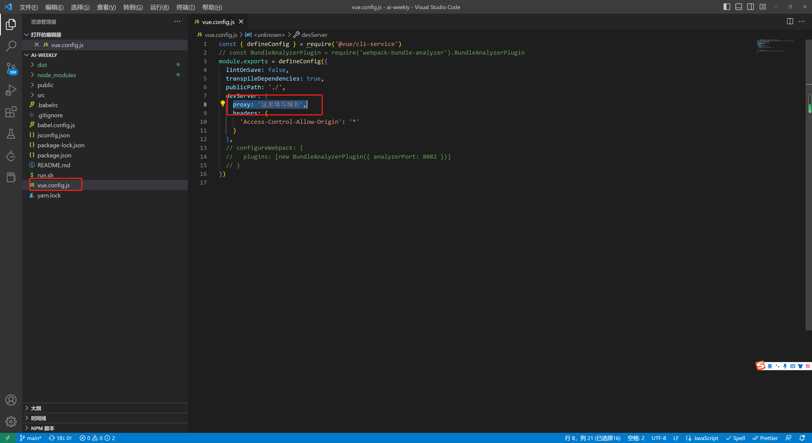

# [官网](https://aicodehelper.com/tools/index.html#/)

## 基于OPENAI开发的简易小工具，欢迎大家使用


## 使用说明

### 使用前请替换域名


## Project setup
```
npm run install
```

### Compiles and hot-reloads for development
```
npm run serve
```

### Compiles and minifies for production
```
npm run build
```

### Lints and fixes files
```
npm run lint
```
